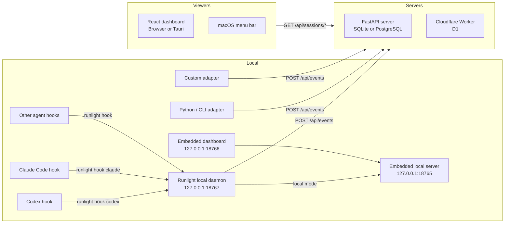

# Runlight

<p align="center">
  
</p>

<p align="center">
  <strong>Passive observability for AI coding agent sessions.</strong>
</p>

<p align="center">
  <a href="#quick-start">Quick Start</a> |
  <a href="#architecture">Architecture</a> |
  <a href="#agent-integrations">Agent Integrations</a> |
  <a href="#deployment">Deployment</a> |
  <a href="#development">Development</a>
</p>

<p align="center">
  
  
  
  
</p>

Runlight records lifecycle events from Codex, Claude Code, and custom
agent adapters without taking control of the agent. It stores session starts,
heartbeats, tool and command activity, prompts, permission waits, completions,
failures, and aborts behind one shared API.

Use it when you want to see which agents are running, waiting, stale, finished,
or failed across projects, machines, branches, and sessions. The repository
contains local and serverless backends, a React dashboard, a macOS menu bar
viewer, packaged hook integrations for common agent CLIs, and a Python adapter
for custom clients.

## Features

- Daemon-first local ingestion for Codex, Claude Code, and other hook-capable agent CLIs
- Optional local approval queue for blocking permission hooks, with dashboard Allow, Always, and Deny actions
- npm-installed `runlight` CLI with one-command setup, login, status, health, settings, and plugin installation commands
- Local durable queue for hook events before upload
- Shared event protocol for all agent adapters
- Live session status inference from real events and heartbeats
- Project-grouped dashboard with session pins, branches, machines, and paths
- Message-style run feed plus per-session event timelines
- Embedded local server and static dashboard for single-machine use
- Local FastAPI server with SQLite by default and PostgreSQL support
- Cloudflare Worker backend with D1 storage and the same API contract
- Token-to-user mapping for small teams or hosted deployments
- Python adapter and CLI wrapper for generic command monitoring
- macOS menu bar viewer and Tauri-wrapped dashboard surface

## Architecture



Agent hooks never upload directly to the hosted server. They hand raw hook
payloads to the local daemon, which maps them to Runlight protocol events, adds
local metadata such as Codex titles, pinned state, and automation hints, stores
events in `~/.runlight/queue`, handles local approval waits when enabled, and
uploads events with the user's dashboard-generated upload token. The same server
and viewer contract works against both server implementations.
See [docs/architecture.md](docs/architecture.md) for the detailed component
model and deployment boundaries.

## Repository Layout

| Path | Purpose |
|---|---|
| [server/](server/) | Self-hosted FastAPI API server |
| [workers/](workers/) | Cloudflare Workers + D1 API-compatible server |
| [dashboard/](dashboard/) | React dashboard and Tauri desktop wrapper |
| [menubar/](menubar/) | Swift macOS menu bar viewer |
| [bin/](bin/) and [src/local/](src/local/) | npm `runlight` CLI, local daemon, queue, settings, and hook adapters |
| [adapters/codex-hook/](adapters/codex-hook/) | Compatibility installer and shim for Codex hooks |
| [adapters/claude-code-hook/](adapters/claude-code-hook/) | Compatibility installer and shim for Claude Code hooks |
| [adapters/python/](adapters/python/) | Python client library and `runlight` CLI |
| [plugins/runlight-codex/](plugins/runlight-codex/) | Packaged Codex plugin |
| [plugins/runlight-claude/](plugins/runlight-claude/) | Packaged Claude Code plugin |
| [docs/](docs/) | Architecture and deployment notes |

## Quick Start

For the hosted Cloudflare deployment, the normal user path is the npm CLI plus a
dashboard-generated upload token. You need Node.js 20+ and npm.

### 1. Install the local CLI

```bash
npm install -g runlight
```

From a source checkout, use:

```bash
npm install -g .
```

To upgrade an existing npm install before `runlight upgrade` is available:

```bash
npm install -g runlight@latest
runlight --version
runlight plugin all
runlight daemon restart
```

Newer versions can upgrade themselves:

```bash
runlight upgrade
```

### 2. Set up this machine

```bash
runlight setup
```

The setup flow asks which mode you want:

- **Runlight Cloud** opens a browser login page, signs you in, returns the
  upload credential to the CLI automatically, starts the daemon, and installs
  local agent hooks.
- **Local only** starts an embedded local server, dashboard, and daemon on this
  machine. It does not require an account or a visible token.
- **Self-hosted** lets this machine run the server, act as a client for another
  server, or do both. Client machines only need the server address.

Non-interactive setup is also available:

```bash
runlight setup --cloud
runlight setup --local
runlight setup --self-hosted --role server
runlight setup --self-hosted --role client --server 192.168.1.20:18765
runlight setup --self-hosted --role both
```

Codex will ask you to review the new hooks the next time you start a Codex
session. Choose **Trust all and continue** once; after that Runlight runs in the
background.

### 3. Verify local setup

```bash
runlight status
```

Start a fresh agent session after installing hooks, then watch it
appear in the dashboard.

For advanced/manual setup, open `/connect` on your Runlight server without a
CLI handoff code, copy the token shown there, then use `runlight login`,
`runlight daemon start`, and `runlight plugin <agent>`.

To disconnect this machine from Runlight:

```bash
runlight logout
```

Logout removes the local upload token, uninstalls local agent hooks, and
stops the local daemon. Run `runlight setup` again to reconnect.

### Local Development Server

`runlight setup --local` is the normal local-only path. To run the FastAPI
server and React dashboard from source for development:

```bash
cd server
python -m venv .venv
source .venv/bin/activate
pip install -e ".[dev]"
python -m uvicorn runlight.app:app --host 127.0.0.1 --port 8766

cd ../dashboard
npm install
npm run dev -- --host 127.0.0.1 --port 3000
```

Point the daemon at the source server with `runlight setting` or
`runlight login --server http://127.0.0.1:8766 --token <token>`.

## Agent Integrations

### Codex

Install Codex hooks through the npm CLI:

```bash
runlight plugin codex
```

The installer writes user-level hook configuration to `$CODEX_HOME/hooks.json`
or `~/.codex/hooks.json` and enables Codex's local hook feature in
`$CODEX_HOME/config.toml` or `~/.codex/config.toml`. The hook command is
`runlight hook codex`, so Codex only talks to the local daemon.

The packaged Codex plugin is still useful for skill/marketplace workflows:

```bash
codex plugin marketplace add /path/to/Runlight
codex plugin add runlight@runlight-local

RUNLIGHT_PLUGIN_DIR="$(ls -td ~/.codex/plugins/cache/runlight-local/runlight/* | head -1)"
bash "$RUNLIGHT_PLUGIN_DIR/skills/runlight/scripts/install-codex-hook.sh"
```

The local daemon adds Codex session title and pinned-thread state when those
local Codex state files are available.

### Claude Code

Install Claude Code hooks through the npm CLI:

```bash
runlight plugin claude
```

The installer writes user-level hook configuration to `~/.claude/settings.json`
unless `CLAUDE_SETTINGS_FILE` is set. The hook command is `runlight hook claude`,
so Claude Code only talks to the local daemon.

The packaged plugin remains available:

```bash
cd plugins/runlight-claude
bash install.sh
```

The Claude Code integration records session lifecycle, tool activity,
permission requests, prompts, subagent starts and stops, and terminal events.

Permission requests are installed as blocking local hooks where the provider
supports that behavior. The local daemon records the wait, exposes it to the
local dashboard, and writes the allow/deny hook response back to the waiting
agent after the user decides. Hosted Runlight APIs remain an observability
surface; approval decisions are served by the local daemon on the machine that
is running the hook.

### Kimi Code

Install Kimi Code hooks through the npm CLI:

```bash
runlight plugin kimi
```

The installer writes hook entries to `$KIMI_CODE_HOME/config.toml` or
`~/.kimi-code/config.toml`, which is the user-level configuration read by Kimi
Code. Legacy `~/.kimi/settings.json` files are not used by current Kimi Code
hook loading.

### Additional Agents

Runlight's hook registry recognizes the same built-in source vocabulary across
normalization, ingestion, and plugin installation:

```text
claude, codex, gemini, cursor, cursor-cli, trae, traecn, traecli,
copilot, qoder, qoder-cli, droid, codebuddy, codybuddycn, stepfun,
opencode, antigravity, google-antigravity, workbuddy, hermes, qwen,
kimi, pi, kiro, cline
```

Use `runlight plugin <agent>` for agents with JSON hook configuration support,
or configure a provider-specific extension to call `runlight hook <agent>` and
send the provider's hook JSON on stdin.

### Python and Generic CLI

Install the Python adapter:

```bash
cd adapters/python
pip install -e ".[dev]"
```

Wrap a command:

```bash
runlight-adapter run --agent generic -- python -m pytest
```

Send manual lifecycle events:

```bash
runlight-adapter event --session demo-1 --type user_input.waiting --summary "Waiting for review"
runlight-adapter heartbeat --session demo-1
runlight-adapter finish --session demo-1 --result completed --summary "Done"
```

Configure the adapter with environment variables:

```bash
export RUNLIGHT_SERVER_URL=http://127.0.0.1:18765
export RUNLIGHT_TOKEN=
```

## Deployment

### Local or LAN Self-Hosting

The npm CLI can run an embedded server and dashboard without Python:

```bash
runlight setup --local
runlight setup --self-hosted --role server
runlight setup --self-hosted --role client --server <server-host>:18765
runlight setup --self-hosted --role both
```

The embedded server stores local data under `~/.runlight/local-server.json` and
accepts empty credentials as the `default` user. If clients provide bearer
tokens, the same token maps to the same hashed local user id.

The FastAPI server is still available for Python/PostgreSQL deployments. It uses
SQLite by default:

```bash
cd server
python -m uvicorn runlight.app:app --host 127.0.0.1 --port 8766
```

For FastAPI LAN access or multi-user testing, bind to all interfaces and set a
token map:

```bash
RUNLIGHT_TOKEN_MAP='tok-alice:alice,tok-bob:bob' \
python -m uvicorn runlight.app:app --host 0.0.0.0 --port 8766
```

FastAPI clients and viewers then use the same connection shape:

```json
{
  "server_url": "http://<server-host>:8766",
  "token": "tok-alice"
}
```

For PostgreSQL, set:

```bash
export RUNLIGHT_DATABASE_URL='postgresql+asyncpg://runlight:<password>@<host>:5432/runlight'
```

### Cloudflare Workers and D1

The Worker backend is API-compatible with the FastAPI server.

```bash
cd workers
npm install
npm run verify
npm run db:create
```

Copy the generated D1 database id into [workers/wrangler.toml](workers/wrangler.toml),
then run:

```bash
npx wrangler d1 migrations apply runlight-db --remote
npx wrangler secret put PUBLIC_BASE_URL
npx wrangler secret put GITHUB_CLIENT_ID
npx wrangler secret put GITHUB_CLIENT_SECRET
npx wrangler secret put GOOGLE_CLIENT_ID
npx wrangler secret put GOOGLE_CLIENT_SECRET
npm run deploy
```

The hosted dashboard uses GitHub or Google OAuth sessions. `runlight setup`
opens `/connect?cli_code=...`, signs the user in, and returns a short-lived
upload token to the CLI automatically. Set `PUBLIC_BASE_URL` to the dashboard
origin, for example
`https://runlight.renaissancemind.ai`. OAuth callbacks are
`/auth/callback/github` and `/auth/callback/google`. `RUNLIGHT_TOKEN_MAP`
remains available for static small-team deployments, but generated dashboard
tokens are the normal hosted flow. See [workers/README.md](workers/README.md)
for the full Cloudflare flow.

## API Contract

All clients and viewers use the same REST API:

| Method | Path | Purpose |
|---|---|---|
| `POST` | `/api/events` | Ingest one event or `{ "events": [...] }` batch |
| `GET` | `/api/health` | Health check |
| `GET` | `/api/ingest/health` | Bearer-token ingest credential check |
| `GET` | `/api/users/current` | Resolve current user from bearer token |
| `GET` | `/api/sessions/live` | List active, pinned, or still-visible sessions |
| `GET` | `/api/sessions` | List sessions with optional filters |
| `GET` | `/api/sessions/:id` | Fetch one session |
| `GET` | `/api/sessions/:id/events` | Fetch a session timeline |
| `GET` | `/api/events/recent` | Fetch recent completion events |
| `DELETE` | `/api/sessions/:id` | Delete one session and its events |
| `GET` | `/api/tokens` | List upload token previews for the signed-in user |
| `POST` | `/api/tokens` | Generate an upload token for agent hooks |
| `DELETE` | `/api/tokens/:id` | Delete one upload token |
| `GET` | `/api/user-settings` | Read the signed-in user's theme and language defaults |
| `PATCH` | `/api/user-settings` | Save the signed-in user's theme and language defaults |
| `POST` | `/api/connect/cli` | Browser side of automatic CLI setup handoff |
| `GET` | `/api/connect/cli/:code` | CLI side of automatic setup token handoff |

Single-event ingest example:

```bash
curl -X POST http://127.0.0.1:18765/api/events \
  -H "Content-Type: application/json" \
  -d '{
    "session_id": "demo-1",
    "agent_type": "generic",
    "adapter_name": "curl",
    "event_type": "session.started",
    "event_time": "2026-06-10T00:00:00Z",
    "summary": "Manual smoke test"
  }'
```

Standard event types include `session.started`, `session.heartbeat`,
`tool.started`, `tool.finished`, `command.started`, `command.finished`,
`permission.requested`, `permission.resolved`, `user_input.waiting`, `external.waiting`,
`session.completed`, `session.failed`, and `session.aborted`.

## Configuration

Server environment variables use the `RUNLIGHT_` prefix.

Local CLI configuration lives in `~/.runlight/config.json` unless
`RUNLIGHT_HOME` is set. Defaults are `127.0.0.1:18765` for the embedded local
server, `127.0.0.1:18766` for the embedded dashboard, and `127.0.0.1:18767` for
the local daemon. The daemon stores queued hook events under
`~/.runlight/queue` and uploads them to the configured server.

Useful local commands:

```bash
runlight setup
runlight login
runlight logout
runlight upgrade
runlight setting
runlight status
runlight health
runlight daemon start
runlight server start
runlight dashboard start
runlight plugin codex
runlight plugin claude
```

| Variable | Default | Description |
|---|---|---|
| `RUNLIGHT_SERVER_HOST` | `127.0.0.1` | Host used by server settings |
| `RUNLIGHT_SERVER_PORT` | `8766` | Port used by server settings |
| `RUNLIGHT_DATABASE_URL` | `sqlite+aiosqlite:///runlight.db` | SQLAlchemy database URL |
| `RUNLIGHT_TOKEN_MAP` | empty | Comma-separated `token:user_id` map |
| `RUNLIGHT_ALLOWED_TOKENS` | empty | Tokens mapped to the default user |
| `RUNLIGHT_HEARTBEAT_STALE_SECONDS` | `120` | Gap before a live session is marked stale |
| `RUNLIGHT_EVENT_RETENTION_DAYS` | `30` | Event retention setting |
| `RUNLIGHT_SESSION_RETENTION_DAYS` | `90` | Session retention setting |
| `RUNLIGHT_CORS_ORIGINS` | `*` | Comma-separated allowed origins |
| `RUNLIGHT_MAX_PAYLOAD_BYTES` | `65536` | Maximum accepted payload size |
| `RUNLIGHT_REQUIRE_AUTH` | unset | Worker-only browser/API mode; set to `true` to require OAuth session or bearer token |

The server and adapters still accept the previous `AGENT_MONITOR_*` names as
compatibility fallbacks, but new deployments should use `RUNLIGHT_*`.

An empty or missing bearer token maps to the `default` user. Once a token map is
configured, unknown bearer tokens are rejected.

## Development

Run checks for the component you changed.

### Local npm CLI and daemon

```bash
npm test
```

### Server

```bash
cd server
pip install -e ".[dev]"
pytest
```

### Dashboard

```bash
cd dashboard
npm install
npm test
npm run build
```

Run the Tauri desktop shell:

```bash
cd dashboard
npm run tauri dev
```

### Workers

```bash
cd workers
npm install
npm run verify
```

### Python adapter

```bash
cd adapters/python
pip install -e ".[dev]"
pytest
```

### macOS menu bar viewer

```bash
cd menubar
swift run RunlightBar
```

## Documentation

- [Architecture](docs/architecture.md)
- [Deployment](docs/deployment.md)
- [Cloudflare Worker backend](workers/README.md)
- [Codex plugin](plugins/runlight-codex/README.md)
- [Claude Code plugin](plugins/runlight-claude/README.md)

## Known Boundaries

- Hook installers modify user-level agent configuration files.
- Codex plugin installation alone does not activate monitoring; run
  `runlight plugin codex` or the bundled hook installer after plugin install or
  update.
- Agent hooks are fail-open and only call the local daemon. The daemon owns
  token storage, event enrichment, approval waits, queueing, retry, and upload.
- Do not expose the self-hosted server to untrusted networks without TLS and an
  explicit auth boundary.
- No license file is currently present in this repository.

## Contributing

Focused issues and pull requests are welcome. For changes that affect the event
protocol, API contract, hook installers, or status inference, include tests for
the touched component and update the relevant documentation.

## License

No license has been declared yet. Add a LICENSE file before distributing or
accepting external contributions under an open-source license.
