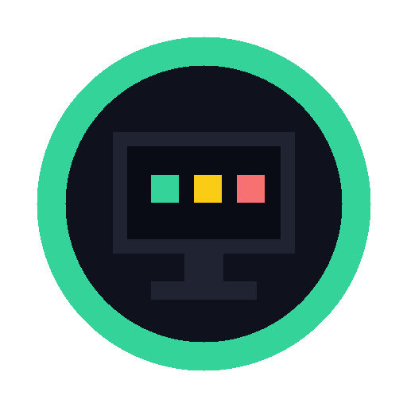
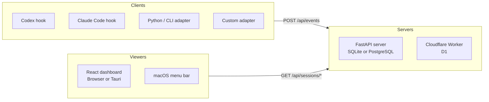

# AgentMonitor

<p align="center">
  
</p>

<p align="center">
  <strong>Passive observability for AI coding agent sessions.</strong>
</p>

<p align="center">
  <a href="#quick-start">Quick Start</a> |
  <a href="#architecture">Architecture</a> |
  <a href="#agent-integrations">Agent Integrations</a> |
  <a href="#deployment">Deployment</a> |
  <a href="#development">Development</a>
</p>

<p align="center">
  
  
  
  
</p>

AgentMonitor records lifecycle events from Codex, Claude Code, and custom
agent adapters without taking control of the agent. It stores session starts,
heartbeats, tool and command activity, prompts, permission waits, completions,
failures, and aborts behind one shared API.

Use it when you want to see which agents are running, waiting, stale, finished,
or failed across projects, machines, branches, and sessions. The repository
contains local and serverless backends, a React dashboard, a macOS menu bar
viewer, packaged Codex and Claude Code integrations, and a Python adapter for
custom clients.

## Features

- Passive hook ingestion for Codex and Claude Code
- Shared event protocol for all agent adapters
- Live session status inference from real events and heartbeats
- Project-grouped dashboard with session pins, branches, machines, and paths
- Message-style run feed plus per-session event timelines
- Local FastAPI server with SQLite by default and PostgreSQL support
- Cloudflare Worker backend with D1 storage and the same API contract
- Token-to-user mapping for small teams or hosted deployments
- Python adapter and CLI wrapper for generic command monitoring
- macOS menu bar viewer and Tauri-wrapped dashboard surface

## Architecture



The same client and viewer contract works against both server implementations.
See [docs/architecture.md](docs/architecture.md) for the detailed component
model and deployment boundaries.

## Repository Layout

| Path | Purpose |
|---|---|
| [server/](server/) | Self-hosted FastAPI API server |
| [workers/](workers/) | Cloudflare Workers + D1 API-compatible server |
| [dashboard/](dashboard/) | React dashboard and Tauri desktop wrapper |
| [menubar/](menubar/) | Swift macOS menu bar viewer |
| [adapters/codex-hook/](adapters/codex-hook/) | Local-development Codex hook installer and script |
| [adapters/claude-code-hook/](adapters/claude-code-hook/) | Local-development Claude Code hook installer and script |
| [adapters/python/](adapters/python/) | Python client library and `agent-monitor` CLI |
| [plugins/agent-monitor-codex/](plugins/agent-monitor-codex/) | Packaged Codex plugin |
| [plugins/agent-monitor-claude/](plugins/agent-monitor-claude/) | Packaged Claude Code plugin |
| [docs/](docs/) | Architecture and deployment notes |

## Quick Start

This starts the local FastAPI server, the web dashboard, and one agent hook
client. You need Python 3.11+, Node.js 18+, npm, and `jq`.

### 1. Start the API server

```bash
cd server
python -m venv .venv
source .venv/bin/activate
pip install -e ".[dev]"
python -m uvicorn agent_monitor.app:app --host 127.0.0.1 --port 8766
```

Verify the server:

```bash
curl http://127.0.0.1:8766/api/health
```

Expected response:

```json
{"status":"ok","service":"agent-monitor"}
```

### 2. Start the dashboard

In another terminal:

```bash
cd dashboard
npm install
npm run dev -- --host 127.0.0.1 --port 3000
```

Open `http://127.0.0.1:3000`. The dashboard defaults to
`http://127.0.0.1:8766`; you can edit the server URL and token in Settings.

### 3. Install an agent hook

For Codex local development:

```bash
bash adapters/codex-hook/install.sh http://127.0.0.1:8766
```

For Claude Code local development:

```bash
bash adapters/claude-code-hook/install.sh http://127.0.0.1:8766
```

These installers write user-level hook configuration:

- Codex: `$CODEX_HOME/hooks.json` or `~/.codex/hooks.json`
- Claude Code: `~/.claude/settings.json` unless `CLAUDE_SETTINGS_FILE` is set

Start a fresh agent session after installing hooks, then watch it appear in the
dashboard.

## Agent Integrations

### Codex

The repository includes both a local hook adapter and a packaged Codex plugin.
The plugin installation makes the AgentMonitor skill and scripts available; the
hook installer is the step that starts event collection.

Local adapter:

```bash
bash adapters/codex-hook/install.sh http://127.0.0.1:8766
```

Packaged plugin flow:

```bash
codex plugin marketplace add /path/to/AgentMonitor
codex plugin add agent-monitor@agent-monitor-local

AGENT_MONITOR_PLUGIN_DIR="$(ls -td ~/.codex/plugins/cache/agent-monitor-local/agent-monitor/* | head -1)"
bash "$AGENT_MONITOR_PLUGIN_DIR/skills/agent-monitor/scripts/install-codex-hook.sh"
```

Codex events include session title and pinned-thread state when those local
Codex state files are available.

### Claude Code

Use the local adapter for repository development:

```bash
bash adapters/claude-code-hook/install.sh http://127.0.0.1:8766
```

Use the packaged plugin for Claude Code plugin workflows:

```bash
cd plugins/agent-monitor-claude
bash install.sh --server http://127.0.0.1:8766
```

The Claude Code integration records session lifecycle, tool activity,
permission requests, prompts, subagent starts and stops, and terminal events.

### Python and Generic CLI

Install the Python adapter:

```bash
cd adapters/python
pip install -e ".[dev]"
```

Wrap a command:

```bash
agent-monitor run --agent generic -- python -m pytest
```

Send manual lifecycle events:

```bash
agent-monitor event --session demo-1 --type user_input.waiting --summary "Waiting for review"
agent-monitor heartbeat --session demo-1
agent-monitor finish --session demo-1 --result completed --summary "Done"
```

Configure the adapter with environment variables:

```bash
export AGENT_MONITOR_SERVER_URL=http://127.0.0.1:8766
export AGENT_MONITOR_TOKEN=
```

## Deployment

### Local or LAN self-hosting

The FastAPI server uses SQLite by default:

```bash
cd server
python -m uvicorn agent_monitor.app:app --host 127.0.0.1 --port 8766
```

For LAN access or multi-user testing, bind to all interfaces and set a token
map:

```bash
AGENT_MONITOR_TOKEN_MAP='tok-alice:alice,tok-bob:bob' \
python -m uvicorn agent_monitor.app:app --host 0.0.0.0 --port 8766
```

Clients and viewers then use the same connection shape:

```json
{
  "server_url": "http://<server-host>:8766",
  "token": "tok-alice"
}
```

For PostgreSQL, set:

```bash
export AGENT_MONITOR_DATABASE_URL='postgresql+asyncpg://agent_monitor:<password>@<host>:5432/agent_monitor'
```

### Cloudflare Workers and D1

The Worker backend is API-compatible with the FastAPI server.

```bash
cd workers
npm install
npm run verify
npm run db:create
```

Copy the generated D1 database id into [workers/wrangler.toml](workers/wrangler.toml),
then run:

```bash
npx wrangler d1 migrations apply agent-monitor-db --remote
npx wrangler secret put TOKEN_MAP
npm run deploy
```

Use `TOKEN_MAP` with the same `token:user_id` format as
`AGENT_MONITOR_TOKEN_MAP`. See [workers/README.md](workers/README.md) for the
full Cloudflare flow.

## API Contract

All clients and viewers use the same REST API:

| Method | Path | Purpose |
|---|---|---|
| `POST` | `/api/events` | Ingest one event or `{ "events": [...] }` batch |
| `GET` | `/api/health` | Health check |
| `GET` | `/api/users/current` | Resolve current user from bearer token |
| `GET` | `/api/sessions/live` | List active, pinned, or still-visible sessions |
| `GET` | `/api/sessions` | List sessions with optional filters |
| `GET` | `/api/sessions/:id` | Fetch one session |
| `GET` | `/api/sessions/:id/events` | Fetch a session timeline |
| `GET` | `/api/events/recent` | Fetch recent completion events |
| `DELETE` | `/api/sessions/:id` | Delete one session and its events |

Single-event ingest example:

```bash
curl -X POST http://127.0.0.1:8766/api/events \
  -H "Content-Type: application/json" \
  -d '{
    "session_id": "demo-1",
    "agent_type": "generic",
    "adapter_name": "curl",
    "event_type": "session.started",
    "event_time": "2026-06-10T00:00:00Z",
    "summary": "Manual smoke test"
  }'
```

Standard event types include `session.started`, `session.heartbeat`,
`tool.started`, `tool.finished`, `command.started`, `command.finished`,
`permission.requested`, `user_input.waiting`, `external.waiting`,
`session.completed`, `session.failed`, and `session.aborted`.

## Configuration

Server environment variables use the `AGENT_MONITOR_` prefix.

| Variable | Default | Description |
|---|---|---|
| `AGENT_MONITOR_SERVER_HOST` | `127.0.0.1` | Host used by server settings |
| `AGENT_MONITOR_SERVER_PORT` | `8766` | Port used by server settings |
| `AGENT_MONITOR_DATABASE_URL` | `sqlite+aiosqlite:///agent_monitor.db` | SQLAlchemy database URL |
| `AGENT_MONITOR_TOKEN_MAP` | empty | Comma-separated `token:user_id` map |
| `AGENT_MONITOR_ALLOWED_TOKENS` | empty | Tokens mapped to the default user |
| `AGENT_MONITOR_HEARTBEAT_STALE_SECONDS` | `120` | Gap before a live session is marked stale |
| `AGENT_MONITOR_EVENT_RETENTION_DAYS` | `30` | Event retention setting |
| `AGENT_MONITOR_SESSION_RETENTION_DAYS` | `90` | Session retention setting |
| `AGENT_MONITOR_CORS_ORIGINS` | `*` | Comma-separated allowed origins |
| `AGENT_MONITOR_MAX_PAYLOAD_BYTES` | `65536` | Maximum accepted payload size |

An empty or missing bearer token maps to the `default` user. Once a token map is
configured, unknown bearer tokens are rejected.

## Development

Run checks for the component you changed.

### Server

```bash
cd server
pip install -e ".[dev]"
pytest
```

### Dashboard

```bash
cd dashboard
npm install
npm test
npm run build
```

Run the Tauri desktop shell:

```bash
cd dashboard
npm run tauri dev
```

### Workers

```bash
cd workers
npm install
npm run verify
```

### Python adapter

```bash
cd adapters/python
pip install -e ".[dev]"
pytest
```

### macOS menu bar viewer

```bash
cd menubar
swift run AgentMonitorBar
```

## Documentation

- [Architecture](docs/architecture.md)
- [Deployment](docs/deployment.md)
- [Cloudflare Worker backend](workers/README.md)
- [Codex plugin](plugins/agent-monitor-codex/README.md)
- [Claude Code plugin](plugins/agent-monitor-claude/README.md)

## Known Boundaries

- Hook installers modify user-level Codex or Claude Code configuration.
- Codex plugin installation alone does not activate monitoring; run the bundled
  hook installer after plugin install or update.
- The local development hooks are fail-open and best-effort so monitoring does
  not block agent work.
- Do not expose the self-hosted server without TLS and an explicit token map.
- No license file is currently present in this repository.

## Contributing

Focused issues and pull requests are welcome. For changes that affect the event
protocol, API contract, hook installers, or status inference, include tests for
the touched component and update the relevant documentation.

## License

No license has been declared yet. Add a LICENSE file before distributing or
accepting external contributions under an open-source license.
